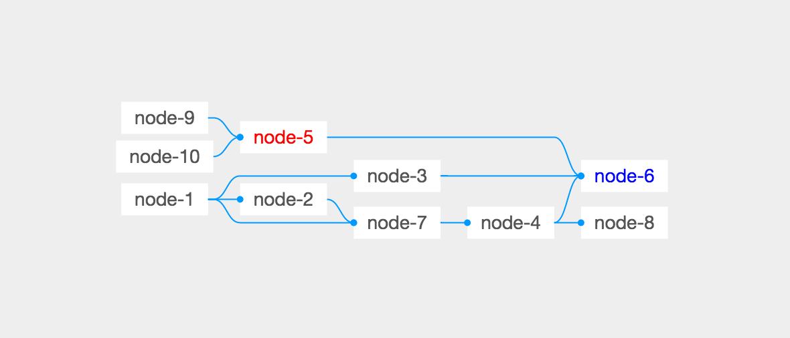

gview
=====

> Fork from: [egraph](https://github.com/likr/egraph)

[](https://www.npmjs.com/package/gview)
[](https://www.npmjs.com/package/gview)

## Install

```bash
$ npm install gview
```

## Usage

[Example](examples/)

```
import GView from 'gview';

const data = {
  vertices: [{
    id: 1,
    name: 'node-1'
  }, {
    id: 2,
    name: 'node-2'
  }],
  edges: [{
    from: 1,
    to: 2
  }]
};

const viewer = new GView('root', data, {
  width: 800,
  height: 400,
  hited: function(list) {
    console.log(list);
  }
});
```




## Develop

```
npm i dool -g

# Dev
$ dool server

# Build
$ dool build
```

## Report a issue

* [All issues](https://github.com/d-band/gview/issues)
* [New issue](https://github.com/d-band/gview/issues/new)

## License

Gview is available under the terms of the MIT License.
